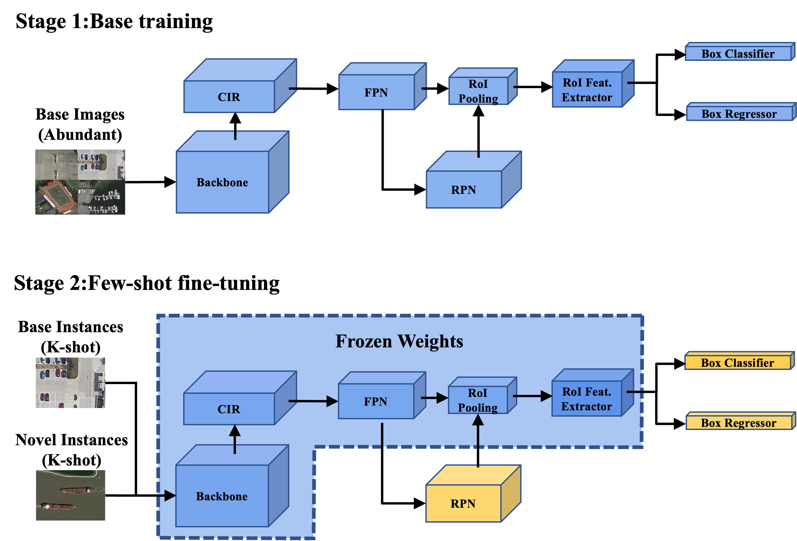

# Context Information Refinement for Few-Shot Object Detection in Remote Sensing Images
Citation: Wang, Y.; Xu, C.; Liu, C Li, Z. Context Information Refinement for Few-Shot Object Detection in Remote Sensing Images. Remote Sens. 2022, 14, 3255. https:// doi.org/10.3390/rs14143255

This repo contains the implementation of our *state-of-the-art* few-shot object detector for remote sensing images, described in our paper, Context Information Refinement for Few-Shot Object Detection in Remote Sensing Images. CIR-FSD is built upon the codebase [FSCE](https://github.com/MegviiDetection/FSCE) and [FsDet v0.1](https://github.com/ucbdrive/few-shot-object-detection/tags), which released by an ICML 2020 paper [Frustratingly Simple Few-Shot Object Detection](https://arxiv.org/abs/2003.06957).




## Installation

FsDet is built on [Detectron2](https://github.com/facebookresearch/detectron2). But you don't need to build detectron2 seperately as this codebase is self-contained. You can follow the instructions below to install the dependencies and build `FsDet`. CIR-FSD functionalities are implemented as `class`and `.py` scripts in FsDet which therefore requires no extra build efforts. 

**Dependencies**

* Linux with Python >= 3.6
* [PyTorch](https://pytorch.org/get-started/locally/) >= 1.3 
* [torchvision](https://github.com/pytorch/vision/) that matches the PyTorch installation
* Dependencies: ```pip install -r requirements.txt```
* pycocotools: ```pip install cython; pip install 'git+https://github.com/cocodataset/cocoapi.git#subdirectory=PythonAPI'```
* [fvcore](https://github.com/facebookresearch/fvcore/): ```pip install 'git+https://github.com/facebookresearch/fvcore'``` 
* [OpenCV](https://pypi.org/project/opencv-python/), optional, needed by demo and visualization ```pip install opencv-python```
* GCC >= 4.9

**Build**

```bash
python setup.py build develop  # you might need sudo
```


Note: you may need to rebuild FsDet after reinstalling a different build of PyTorch.


## Data preparation

Our model supports two datasets: DIOR and NWPU VHR-10, both datasets are processed into VOC 2007 format. 

- [DIOR](http://host.robots.ox.ac.uk/pascal/VOC/): We randomly split the 20 object classes into 15 base classes and 5 novel classes. The splits can be found in [fsdet/data/datasets/builtin_meta.py](fsdet/data/datasets/builtin_meta.py).
- [NWPU VHR-10](http://cocodataset.org/): We randomly split the 10 object classes into 7 base classes and 3 novel classes.

The datasets and data splits are built-in, simply make sure the directory structure agrees with [datasets/README.md](datasets/README.md) to launch the program. 

The default seeds that is used to report performace in research papers can be found in ` dataset/vocsplit/seed `.


## Code Structure

The code structure follows Detectron2 v0.1.* and fsdet. 

- **configs**: Configuration  files (`YAML`) for train/test jobs. 
- **datasets**: Dataset files (see [Data Preparation](#data-preparation) for more details)
- **fsdet**
  - **checkpoint**: Checkpoint code.
  - **config**: Configuration code and default configurations.
  - **data**: Dataset code.
  - **engine**: Contains training and evaluation loops and hooks.
  - **evaluation**: Evaluation code for different datasets.
  - **layers**: Implementations of different layers used in models.
  - **modeling**: Code for models, including backbones, proposal networks, and prediction heads.
    - The majority of CIR-FSD functionality are implemtended in`modeling/backbone/backbone.py `, `modeling/backbone/FPN.py`, and `layers/attention.py`
    - So one can first make sure  [FsDet v0.1](https://github.com/ucbdrive/few-shot-object-detection/tags) runs smoothly, and then refer to CIR-FSD implementations and configurations. 
  - **solver**: Scheduler and optimizer code.
  - **structures**: Data types, such as bounding boxes and image lists.
  - **utils**: Utility functions.
- **tools**
  - **train_net.py**: Training script.
  - **test_net.py**: Testing script.
  - **ckpt_surgery.py**: Surgery on checkpoints.
  - **run_experiments.py**: Running experiments across many seeds.
  - **aggregate_seeds.py**: Aggregating results from many seeds.


## Train & Inference

### Training

We follow the same training procedure of FsDet and we use **random initialization** for novel weights. For a full description of training procedure, see [here](https://github.com/ucbdrive/few-shot-object-detection/blob/master/docs/TRAIN_INST.md).

#### 1. Stage 1: Training base detector.

```
python tools/train_net.py --num-gpus 2 \
--config-file configs/PASCAL_VOC/base-training/R101_FPN_base_training_split1.yml
```

#### 2. Random initialize  weights for novel classes.

```
python tools/ckpt_surgery.py \
        --src1 checkpoints/voc/faster_rcnn/faster_rcnn_R_101_FPN_base1/model_final.pth \
        --method randinit \
        --save-dir checkpoints/voc/faster_rcnn/faster_rcnn_R_101_FPN_all1
```

This step will create a `model_surgery.pth` from` model_final.pth`. 


#### 3. Stage 2: Fine-tune for novel data.

```
python tools/train_net.py --num-gpus 2 \
        --config-file configs/PascalVOC-detection/split1/faster_rcnn_R_101_FPN_ft_all1_1shot-CIR-FRPN-RRPN.yml \
        --opts MODEL.WEIGHTS WEIGHTS_PATH
```

Where `WEIGHTS_PATH` points to the `model_surgery.pth` generated from the previous step. Or you can specify it in the configuration yml. 

#### Evaluation

To evaluate the trained models, run

```angular2html
python tools/test_net.py --num-gpus 2 \
        --config-file configs/PascalVOC-detection/split1/faster_rcnn_R_101_FPN_ft_all1_1shot-CIR-FRPN-RRPN.yml \
        --eval-only
```

Or you can specify `TEST.EVAL_PERIOD` in the configuation yml to evaluate during training. 


### Multiple Runs

For ease of training and evaluation over multiple runs, fsdet provided several helpful scripts in `tools/`.

You can use `tools/run_experiments.py` to do the training and evaluation. For example, to experiment on 30 seeds of the first split of PascalVOC on all shots, run

```angular2html
python tools/run_experiments.py --num-gpus 2 --shots 5 10 20 --seeds 1 11 --split 1 --lr 0.005
```

After training and evaluation, you can use `tools/aggregate_seeds.py` to aggregate the results over all the seeds to obtain one set of numbers. To aggregate the 3-shot results of the above command, run

```angular2html
python tools/aggregate_seeds.py --shots 3 --seeds 10 --split 1 
```


